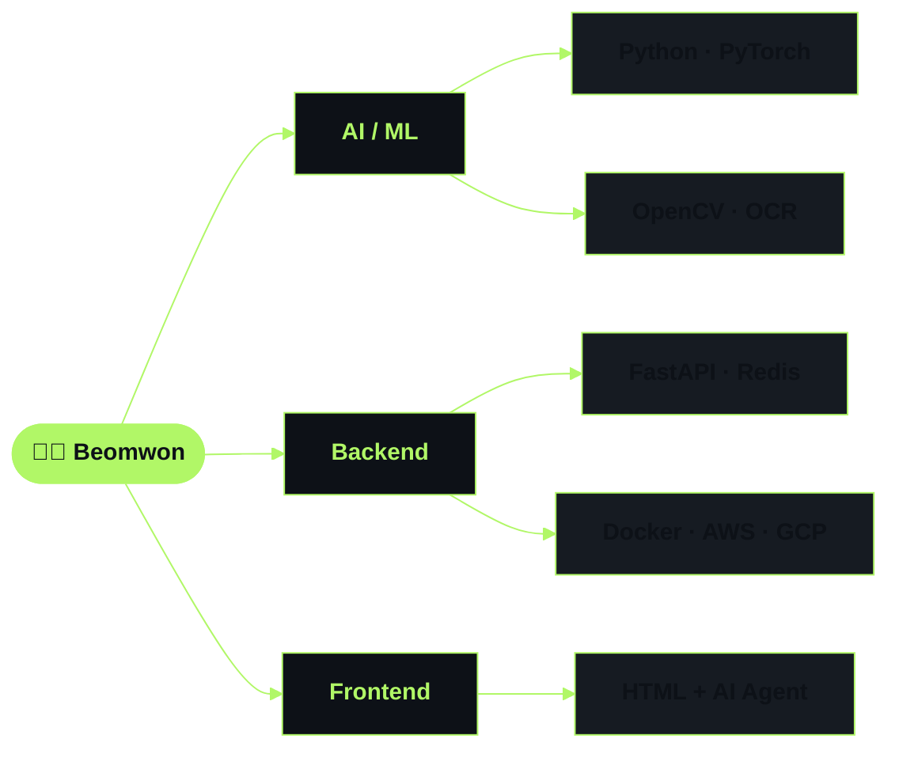

##  About Me

- **AI 에이전트·MCP 서버·딥러닝 서비스**를 만드는 백엔드 개발자입니다
- 기획부터 개발·배포·운영까지 — 앱테크 서비스 **광부**를 직접 만들어 운영했습니다
- 요즘은 **에르메스 엔지니어링**과 **루프 엔지니어링**을 공부하고 있습니다
- 백준·프로그래머스로 **알고리즘** 문제를 풀며 기본기를 다졌습니다

 

##  Tech Stack

**AI / ML**

   

**Backend**

    

**Now Exploring** 천천히 익혀보는 중

 

**Frontend** 기본 HTML + AI 에이전트를 활용한 개발·수정

 

 

##  Timeline

<table>
<tr>
<th width="120">Period</th>
<th width="230">Project</th>
<th>Description</th>
</tr>
<tr>
<td align="center"><b>26.06 ~</b></td>
<td> <b><a href="https://www.whochu.com">후추 (Whochu)</a></b> 안심 신원 인증 서비스</td>
<td><b><a href="https://www.modoo.or.kr/member/espero">모두의 창업 1차 선정</a></b>  — 아이디어·설계부터 개발까지 1인 수행 · 퇴근 후 <b>AI 에이전트를 활용해 3일 만에 개발</b> · KCP 본인인증 + 사기 이력 조회 통합, 소셜 로그인 4종 자체 JWT 연동 · Next.js 15 · Supabase · 토스페이먼츠 · Flutter WebView</td>
</tr>
<tr>
<td align="center"><b>25.09 ~</b></td>
<td> <b>AI 에이전트 · 백엔드 엔지니어</b></td>
<td>· 사내 DB 연동 <b>MCP 서버</b> 개발·운영, <b>Claude 기반 업무 자동화 환경</b> 구축 · 대형 통신사 협업 서비스 핵심 아이디어 제안 → <b>채택되어 실제 개발로 전환</b> · MCP 서버·AI 에이전트 PoC 설계/시연, 금융권 협업 프로젝트 참여</td>
</tr>
<tr>
<td align="center"><b>25.07</b></td>
<td> <b>AIerview / SOOP</b></td>
<td>· <b>AIerview</b> — 이력서 질문·피드백으로 면접을 준비하는 AI 사이트 (Gemini 2.5 · FastAPI · Render) · <b>SOOP</b> — AI 심리테스트·이미지 생성 실험 사이트 (커스텀 도메인 · Vercel)</td>
</tr>
<tr>
<td align="center"><b>25.04 ~ 25.08</b></td>
<td> <b>멋쟁이사자처럼 프론트엔드 부트캠프</b></td>
<td>· <b>AI 에이전트로 프론트를 개발할 때 최소한의 지식이 있으면 더 수월할 것 같아 수강</b> · <b><a href="https://github.com/beomwon/frontend_bootcamp_likelion">UI 팀 프로젝트</a></b> 등 진행 — HTML · CSS · JavaScript · 취업으로 중도 하차</td>
</tr>
<tr>
<td align="center"><b>24.09 ~ 25.06</b></td>
<td> <b><a href="https://play.google.com/store/apps/details?id=com.gwangbuapp&hl=ko">앱테크 '광부' 앱</a></b></td>
<td>· 기획·백엔드·운영 전담 (3인 팀) — <b>누적 다운로드 18,000+ · DAU 1,800</b> · FastAPI + Firebase 알림 + Redis 중복 요청 방지, 관리자 페이지·ERD 직접 설계</td>
</tr>
<tr>
<td align="center"><b>23.01 ~ 25.03</b></td>
<td> <b>AI / R&D 팀장</b></td>
<td>· <b><a href="https://github.com/beomwon/illegal_post_detection_AI">유해물 검출 AI</a></b> — OCR 기반 불법 광고 검출, 1인 개발·배포 후 실서비스 적용 · <b>TIPS 선정 주도</b>  — <b>7억 원 투자 유치</b> (23.05) · <a href="https://github.com/beomwon/osyulaeng">사내 점심 메뉴 추천 서비스</a> (Django · MariaDB), 연차 시스템 자동화 전사 도입</td>
</tr>
<tr>
<td align="center"><b>22.06 ~ 22.12</b></td>
<td> <b>광주인공지능사관학교</b></td>
<td>· <b><a href="https://github.com/beomwon/CCTV_Abnormal_Behavior_Detection_Service">CCTV 이상행동 탐지</a></b> (PM)  <b>최우수상</b> — YOLOv7 · 텔레그램 자동 알림 · <b>AIDA 경진대회 본선</b> (과기정통부) — 도로 위험 요소 탐지 + 날씨 인식 · <a href="https://github.com/beomwon/Emotional_Song_Recommendation_Service">감정 기반 노래 추천</a> — KoELECTRA · StyleGAN2</td>
</tr>
<tr>
<td align="center"><b>14.03 ~ 22.02</b></td>
<td> <b>전북대학교 IT정보공학과</b></td>
<td>· 졸업작품: <b>Super Resolution을 이용한 블랙박스 화질 개선</b> · 나가사키대학교 AI 연구실 교환 프로그램 (2020)</td>
</tr>
</table>

 

##  GitHub Stats

  

